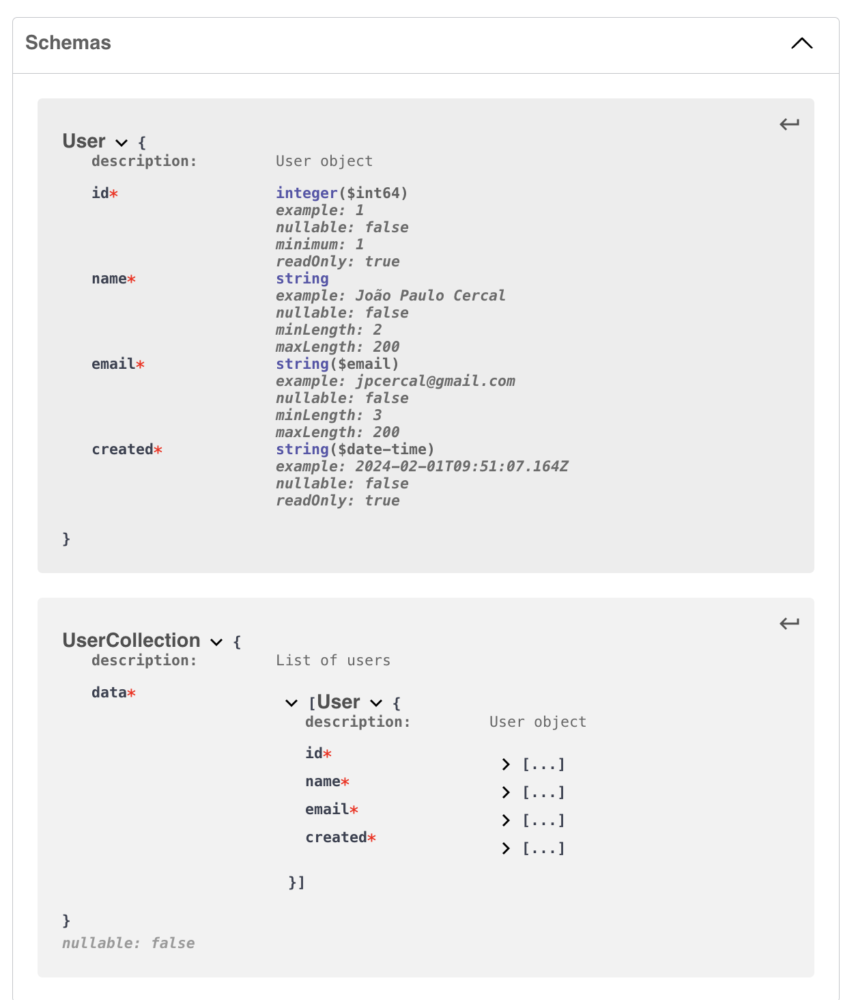
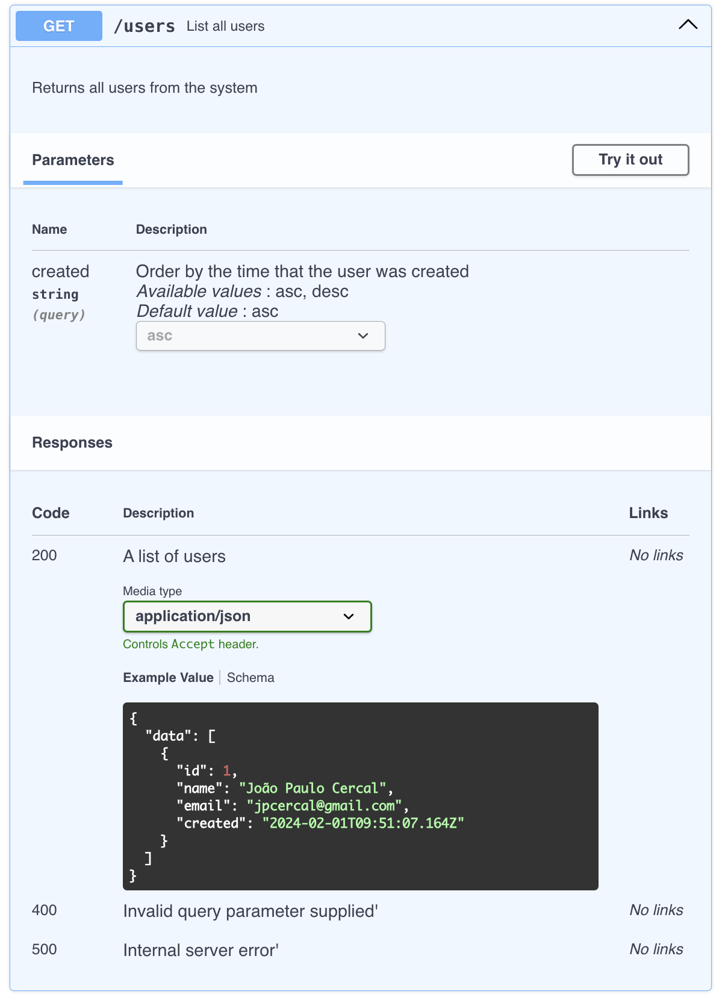
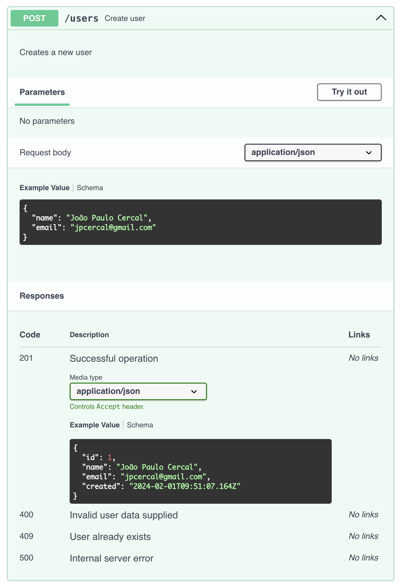

# users-api

[](https://github.com/jpcercal/users-api/actions/workflows/users-api.yml)
[](https://codecov.io/gh/jpcercal/users-api)
[](https://github.com/jpcercal/users-api/blob/main/openapi.yaml)

Welcome to `users-api`, a powerful and scalable REST API for creating and listing user data. This documentation provides comprehensive insights into the installation process, available endpoints, testing strategies, and potential next steps for further enhancement.

## Overview

`users-api` is a `TypeScript` and `Node.js` based application built with the `Express` framework and `TypeORM` for seamless interaction with a `MariaDB` and `SQLite` database. It offers endpoints to **create and list users**, adhering to the `OpenAPI 3` specification. The application embraces `Docker` for containerization, enabling easy deployment and scalability.

## Installation

To get started, ensure you have Docker and Docker Desktop installed on your machine. Follow these steps to set up the project:

```bash
# Clone the repository
git clone https://github.com/jpcercal/users-api.git

# Navigate to the project directory
cd users-api
```

### Build and run the Docker containers

```bash
docker compose up -d
```

For customization of exposed ports, update the `docker-compose.yml` file accordingly. Adjust the ports under the app service to suit your preferences.By default it exposes the webserver on the port `3000`.

```yaml
app:
  ...
  ports:
    - 'your-host-port:3000'
```

## Development environment

The npm `start:watch` script is the go-to command for local development. When executed, this script starts the server in watch mode, which means any changes made to the source code trigger an automatic restart of the server.

It will also turn on the `auto sync` feature of `typeorm`.

```
npm start:watch
```

## Available Endpoints

The API provides the following endpoints compliant with the `OpenAPI` spec:

```bash
# GET /users: Retrieve a list of users with optional sorting by creation date.
# POST /users: Create a new user with the provided name and email.
```

### Request and Response

Check it all on the [openapi.yaml](https://github.com/jpcercal/users-api/blob/main/openapi.yaml) file.

#### The schema



#### GET /users

```bash
curl --request GET --url http://localhost:3000/users
```

The response for this request would look similar to the one shown below:

```json
{
  "data": [
    {
      "id": 1,
      "name": "John Doe",
      "email": "john.doe@example.com",
      "created": "2024-02-01T09:51:07.164Z"
    }
    // Additional users...
  ]
}
```



#### POST /users

```bash
curl --request POST \
    --url http://localhost:3000/users \
    --header 'Content-Type: application/json' \
    --data '{"name": "John Doe", "email": "john.doe@example.com"}'
```



The response for this request would a 201 http status code, meaning that the resource was created successfully on the server.

## Testing

The application boasts a robust testing suite, including `Jest` for unit tests, `SuperTest` for API testing, and `Apache Bench` for performance evaluations. The `GitHub Actions` pipeline ensures continuous integration with automated testing and security checks. To run the tests locally:

```bash
# Execute the test suit
npm test

# On the development environment you can use
npm test:watch
```

## Next Steps

### Pagination and Sorting

Implement pagination for listing users and expand sorting options to include more fields.

### Data Privacy

Enhance security by providing options to hide sensitive user information based on user roles.

### HATEOAS

Integrate HATEOAS to enable easy navigation through API resources, enhancing user experience.

### Authentication/Authorization

Implement robust authentication and authorization mechanisms to secure API endpoints.

### Monitoring

Integrate Application Performance Monitoring (APM) for real-time performance monitoring.

### Metrics

Implement metrics collection using Prometheus to gain insights into application performance.

### Logging

Integrate Sentry for efficient error tracking and logging.

### Caddy Reverse Proxy

Implement Caddy as a reverse proxy for Node.js to enhance security and performance.

### Database and Cache Replication

Explore database and cache layer replication strategies for improved scalability and resilience.

### Infrastructure as Code

Utilize Terraform for Infrastructure as Code (IaC) to manage and scale the infrastructure.

### Service Separation

Consider splitting the monolithic controller into smaller, more manageable services.

### Optimization and Docker Image

Optimize the application and release a Docker image on Docker Hub for easy distribution and deployment.

> These enhancements will contribute to the scalability, security, and maintainability of the users-api, ensuring a robust and efficient API service.
>
> Thank you for choosing `users-api`. Happy coding!
